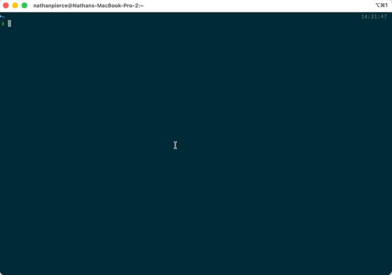

# Anka Crypt

Run your coding agents (Grok Build, Claude, Codex, ...) inside isolated, disposable Anka macOS VMs.

Crypt clones a prepared base VM into a shadow clone, launches the agent in
unattended ("YOLO") mode, and **keeps the clone running between sessions** so
agent state is preserved. Pass `--destroy` to delete after a run, or run
`crypt destroy` later. By default the guest cannot reach your host filesystem.
Pass `--mount PATH` only when you need the agent to edit files on the host.
Repeat `--mount` to share multiple directories. Pass `.` for the current
directory — each shared path is writable from the VM and changes apply on the
host, so mount only directories you are willing to expose.

```text
   host                           Anka VM (kept after run)
  ┌───────────────┐   clone      ┌───────────────────────────────┐
  │ crypt grok    │ ──────────▶  │ grok --always-approve         │
  │               │              │     --no-auto-update          │
  │ --mount .     │ ◀── mount ─▶ │ /Volumes/My Shared Files/$CWD │
  └───────────────┘              └───────────────────────────────┘
```





## Why

Agents run far more smoothly when they aren't stopping to ask permission for every
file edit or shell command. The flags that unlock that (`--always-approve`,
`--dangerously-skip-permissions`, `--dangerously-bypass-approvals-and-sandbox`) are
genuinely dangerous on your host. Crypt makes them safe by confining the agent to
an ephemeral VM.

## Requirements

- **[Anka Virtualization](https://docs.veertu.com/anka/anka-virtualization-cli/getting-started/installing-the-anka-virtualization-package/).** Any recent version works; **3.9 or newer** is required
  when using `--mount` (host directory mounting was added in
  [Anka 3.9.0](https://docs.veertu.com/anka/whats-new/anka-3.9.0/#ability-to-mount-host-directories-inside-of-the-vm)).
- **Apple Silicon** is required for `--mount`. Directory mounts are not supported on Intel.
<!-- - **Anka Enterprise** is required for `--no-local` network isolation. -->
- A base Anka VM that you have prepared with the agent installed and authenticated.

## Install

```sh
brew tap veertuinc/crypt https://github.com/veertuinc/crypt
brew trust veertuinc/crypt
brew update && brew install --cask crypt
```

Homebrew's short tap name (`veertuinc/crypt`) expects a repo named `homebrew-crypt`; the
explicit URL tells it to use this repository instead.

Or download the latest release (macOS only; installs to `/usr/local/bin`, or set `INSTALL_DIR`):

```sh
/bin/bash -c "$(curl -fsSL https://raw.githubusercontent.com/veertuinc/crypt/edge/scripts/install.sh)"
```

Or build from source (requires Go 1.25+):

```sh
go install github.com/veertuinc/crypt@latest
```

## Prepare a base VM (one time)

Crypt clones a prepared base VM for each run. Download or create that base VM once,
then boot it and authenticate the agent(s) you want to use.

1. Get the base VM (default name `crypt-base`; use any name and pass `--vm` later):

   **Pull the public template from Docker Hub** (Apple Silicon; creates `crypt-base`):

   ```sh
   anka --debug pull -o2 --tag 26.4.1-arm64 veertu/getting-started-templates https://registry.hub.docker.com
   anka clone getting-started-templates crypt-base
   ```

   **Or create locally** with the latest macOS template from Anka:

   ```sh
   anka create crypt-base latest
   ```

2. Boot it and install + authenticate the agent(s) you want to use inside it
   (skip installs that are already present in a pulled template):

   ```sh
   anka start crypt-base
   anka run crypt-base zsh -lc '/bin/bash -c "$(curl -fsSL https://raw.githubusercontent.com/Homebrew/install/HEAD/install.sh)" && brew install node'
   # Install Claude (claude)
   anka run crypt-base zsh -lc 'npm install -g @anthropic-ai/claude-code'
   # Optional: set the model to use (default is latest model from anthropic)
   anka run crypt-base bash -c "echo 'export ANTHROPIC_MODEL=\"claude-sonnet-4-5-20250929\"' >> ~/.zprofile"
   anka run crypt-base zsh -lc 'claude'    # follow the login prompts (API keys preferred)
   # Install Codex (codex)
   anka run crypt-base zsh -lc 'npm install -g @openai/codex'
   anka run crypt-base zsh -lc 'codex'     # follow the login prompts (API keys preferred)
   # Install Sakana Fugu (codex-fugu)
   anka run crypt-base zsh -lc 'curl -fsSL https://sakana.ai/fugu/install | bash'
   anka run crypt-base zsh -lc 'codex-fugu'     # follow the login prompts (API keys preferred)
   # Install Grok Build (grok / agent)
   anka run crypt-base zsh -lc 'curl -fsSL https://x.ai/cli/install.sh | bash'
   # Grok adds PATH to ~/.zshrc; Crypt uses login shells (~/.zprofile) for task runs
   anka run crypt-base bash -c "echo 'export PATH=\"\$HOME/.grok/bin:\$PATH\"' >> ~/.zprofile"
   anka run crypt-base bash -c "echo 'XAI_API_KEY=xai-Ah5cwp3..' >> ~/.zprofile" # use API keys when possible to avoid the CLI asking for MFA and hanging your agents
   # stop the base VM
   anka stop crypt-base
   ```

> [!NOTE]
> Interactive sessions (`crypt grok` with no prompt) connect over SSH so the
> agent gets a real terminal. Crypt generates a dedicated SSH key per clone on
> first use (`~/.config/crypt/keys/<vm>/id_ed25519`) and authorizes it in that
> clone automatically via `anka run` before SSH is attempted; you only need Remote Login enabled in the
> base VM. Crypt logs in as the `anka` user by default — override with
> `CRYPT_SSH_USER`. Keys are removed when the clone is destroyed.
>
> Task-mode runs (`crypt grok "fix the test"`) and interactive SSH both launch
> agents with `zsh -lc`, a login shell that reads `~/.zprofile`, not `~/.zshrc`.
> If an installer only updates `~/.zshrc` (Grok does this), add its bin directory
> to `~/.zprofile` as shown above.

<!-- 3. On first setup, harden network access on the base VM (recommended; requires
   Anka Enterprise). Clones inherit this setting:

> [!IMPORTANT]
> `--no-local` is only available with an Enterprise or Enterprise Plus license.

   ```sh
   anka modify crypt-base network --no-local
   ```
-->

Every clone Crypt makes inherits this prepared state, so you only authenticate once.

## Usage

Two approaches:

1. Use `crypt grok` to run the agent in interactive mode.
2. Run `crypt grok "fix the UI bugs from the make test output"` for non-interactive mode.

```bash
❯ crypt grok 'who are you?'
crypt: VM name is crypt-clone-1
crypt: cloning crypt-base -> crypt-clone-1
crypt: starting crypt-clone-1
crypt: SSH: ssh -i '/Users/you/Library/Application Support/crypt/keys/crypt-clone-1/id_ed25519' -o IdentitiesOnly=yes -o StrictHostKeyChecking=no -o UserKnownHostsFile=/dev/null -o LogLevel=ERROR -o ConnectTimeout=5 anka@192.168.64.8
crypt: VNC: open vnc://anka@192.168.64.8
crypt: mounting /Users/you/project
crypt: authorizing SSH key in crypt-clone-1 via anka run
crypt: waiting for SSH on anka@192.168.64.8
crypt: launching grok
I'm Grok Build, xAI's terminal-native coding agent. I can read and edit files, run
shell commands, search your codebase, and help with software engineering tasks.

Is there something specific you'd like help with?
crypt: kept VM crypt-clone-1 running (crypt destroy when done)


❯ crypt grok --mount . "do you see the mount in the VM under /Volumes/My Shared Files"
Yes, I can see the mount! It's visible at `/Volumes/My Shared Files` and is mounted using **AppleVirtIOFS** (Apple's virtualization filesystem for sharing between host and VM).

**Mount details:**
- Device: `/dev/disk0`
- Mount point: `/Volumes/My Shared Files`
- Filesystem: AppleVirtIOFS
- Size: 926GB total, 789GB used, 137GB free
- Contains the `crypt` directory we're currently working in

The mount is working and accessible.
```

#### Examples

```sh
crypt grok --mount . --socket ~/.atrium/ipc/stable.sock::ATRIUM_SOCKET "fix the test"  # forward a host app socket into the VM
crypt claude --mount . "keep going"                          # mount current directory into the VM for this run
crypt claude --mount . --mount ~/.atrium/bin "keep going"    # mount multiple host directories
crypt grok --mount . --mount ~/.grok/skills:grok-skills "fix the test"  # skills appear under /Volumes/My Shared Files/grok-skills
crypt claude                                               # interactive; VM kept until crypt destroy
crypt codex-fugu --mount . "investigate the flaky test"      # Sakana Fugu (codex -p fugu)
crypt grok --mount . "fix the failing test"                  # Grok Build
crypt --name backend claude --mount . "add endpoint"         # separate named VM for another project
crypt claude --destroy "one-shot"                          # delete when the run ends
crypt destroy                                              # delete the kept VM for this directory
crypt --name backend destroy                               # delete a named VM
```

Flags:

| Flag         | Default      | Description                                        |
| ------------ | ------------ | -------------------------------------------------- |
| `--name`     | *(auto)* | Explicit clone VM name (`crypt-clone-1`, `crypt-clone-2`, … when omitted; same directory reuses its clone) |
| `--vm`       | `crypt-base` | Base Anka VM to clone for the sandbox              |
| `--cpu`      | `0`          | Override vCPU core count (`0` = use the VM setting) |
| `--memory`   | `0`          | Override RAM in MB (`0` = use the VM setting)       |
| `--mount`    | *(none)* | Host directory to share with the VM (repeatable; pass `.` for the current directory; optional `:folder_name` under `/Volumes/My Shared Files`) |
| `--env`      | *(none)* | Environment variable to export in the guest before launching the agent (repeatable; `KEY=VALUE`) |
| `--socket`   | *(none)* | Forward a host UNIX socket into the guest over the existing SSH connection (repeatable; `HOSTPATH[:GUESTPATH[:ENVVAR]]`) |
| `--destroy`  | `false`      | Delete the clone when the run ends (default: keep until `crypt destroy`) |
<!-- | `--no-local` | `false`      | Block VM-to-VM and VM-to-host network on the clone (Anka Enterprise)   | -->

Unknown flags (e.g. `--model`, `--resume`) are forwarded to the agent unchanged.

## Forwarding host sockets

macOS virtiofs (used by `--mount`) cannot carry `AF_UNIX` sockets, so you cannot
mount a host app's `.sock` into the guest. Use `--socket` instead: it forwards a
host UNIX socket into the guest over the SSH connection Crypt already opens, so
the VM gets a byte-pipe to exactly that one socket and nothing else on the host.

```sh
crypt grok --socket ~/.atrium/ipc/stable.sock::ATRIUM_SOCKET "from the VM"
```

The flag value is `HOSTPATH[:GUESTPATH[:ENVVAR]]`:

- `HOSTPATH` — the socket on the host (supports `~`). It does not need to exist
  yet; the connection is made the first time the guest uses it.
- `GUESTPATH` — where the socket appears in the guest. Defaults to
  `/Users/<ssh-user>/.crypt/sockets/<basename>`.
- `ENVVAR` — optional; when set, Crypt exports `ENVVAR=GUESTPATH` in the guest so
  the agent finds the socket automatically (the empty middle field in the example
  above keeps the default guest path while still binding `ATRIUM_SOCKET`).

Forwarding uses OpenSSH UNIX-domain remote forwarding (`ssh -R`), so the guest's
sshd needs `AllowStreamLocalForwarding` enabled (the OpenSSH default). Before
each run Crypt removes any stale guest socket file left by an unclean prior
session (crash, `kill -9`, VM snapshot) so sshd can rebind the forward. Without
that cleanup the socket path can exist on disk with nothing listening — `nc -U`
returns "Connection refused" even though `test -S "$ATRIUM_SOCKET"` succeeds.
This is strictly narrower than giving the VM host SSH access: no host shell,
filesystem, or other service is reachable — only the listed socket(s).

## How a run works

1. Verify Anka is installed and the base VM exists (Anka 3.9+ when using `--mount`).
2. `anka clone <base> crypt-clone-N` — an instant shadow clone (lowest free number; printed on stderr).
<!-- 3. With `--no-local`, `anka modify <clone> network --no-local` — block VM-to-VM
   and VM-to-host network traffic (requires Anka Enterprise; usually set once on
   the base VM instead). -->
3. `anka start` the clone (applying any `--cpu` / `--memory` overrides first).
4. With `--mount PATH`, `anka mount <clone> <path>` — each directory appears under
   `/Volumes/My Shared Files/<folder-name>` in the guest. The default folder name
   is the host directory's basename; use `--mount HOST:FOLDER` to override it
   (for example `~/.grok/skills:grok-skills`). The agent starts in the first
   mounted directory. Changes are visible on the host. Only mount directories
   you trust the agent with.
5. Authorize Crypt's SSH key in the clone via `anka run`, then connect over SSH.
   With `--socket`, the agent's SSH connection adds a `-R` UNIX-domain forward so
   the listed host socket(s) appear in the guest (and any bound env var is
   exported); the guest socket is created at session start and removed on exit.
   Launch the agent with its unattended-mode flags injected. For Claude Code,
   Crypt also pre-trusts the guest workspace in `~/.claude.json` so the
   "Do you trust this folder?" dialog is skipped. A task prompt
   (`crypt claude "fix the UI"`) runs unattended over SSH; an interactive
   session (`crypt claude`) connects over `ssh -t` so the agent gets a real
   terminal for its full TUI.
6. On exit (including Ctrl-C), the clone stays running and is kept on disk unless
   you passed `--destroy`, which deletes it. Remove kept clones with
   `crypt destroy` (or `crypt --name <vm> destroy`). If `--mount` paths are added to an
   already-running kept clone, Crypt unmounts those temporary host paths after the
   command finishes. Your base VM is never modified.

## Network isolation

> [!IMPORTANT]
> IP filtering requires an Enterprise or Enterprise Plus license.

Bake [IP filtering rules](https://docs.veertu.com/anka/anka-virtualization-cli/advanced-security-features/#ip-filtering-rules)
into your base VM before Crypt clones it. Crypt warns at run time when filter
rules are enabled. **Always allow inbound TCP port 22 from the host** (and
outbound return traffic) before any deny rules, or Crypt cannot connect over SSH.
Rules are evaluated in order; the first match wins. Example — allow host SSH,
then block other inbound traffic:

```sh
cat <<'EOF' | anka modify crypt-base network -f-
pass in from any port 22
pass out to any
block in from any port 80
EOF
```

You can also set global host rules with `anka config net_filter`, or embed
per-VM rules so clones inherit them. See Anka's
[Advanced Security Features](https://docs.veertu.com/anka/anka-virtualization-cli/advanced-security-features/)
for the full rule syntax and additional options (including TUN/WireGuard on the
host for routing all VM traffic through a VPN).

<!--
[`--no-local`](https://docs.veertu.com/anka/anka-virtualization-cli/advanced-security-features/#block-vm-to-vm-and-vm-to-host-communication)
blocks VM-to-VM and VM-to-host network communication. Enable it once when you
prepare your base VM (recommended — clones inherit the setting):

```sh
anka modify crypt-base network --no-local
```

Or pass `--no-local` on a Crypt run to apply it to that clone only.
-->

## A note on file syncing

When using `--mount`, Anka shares directories via Apple's virtiofs implementation
on macOS. That stack has a known caveat: **edits made on the host after mounting
may appear stale inside the guest.** This is an Apple platform limitation — not a
Crypt bug. In practice it does not affect the common workflow — the agent edits
files *inside* the guest, and those writes propagate back to the host correctly.
If you edit files on the host mid-session, prefer creating new files or atomically
replacing them (write a temp file, then `mv` over the target) so the guest picks
up the change.